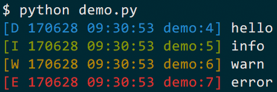
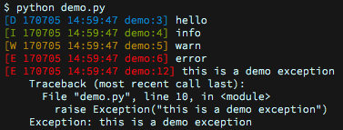

.. highlight:: shell
.. _index:

===================================
`logzero`: Python logging made easy
===================================

Robust and effective logging for Python 2 and 3.

**Features**

* Easy logging to console and/or (rotating) file.
* Provides a fully configured `Python logger object <https://docs.python.org/2/library/logging.html#module-level-functions>`_.
* Pretty formatting, including level-specific colors in the console.
* JSON logging support (with integrated `python-json-logger <https://github.com/madzak/python-json-logger>`_)
* Windows color output supported by `colorama`_
* Robust against str/bytes encoding problems, works with all kinds of character encodings and special characters.
* Multiple loggers can write to the same logfile (also works across multiple Python files).
* Global default logger with `logzero.logger <#i-logzero-logger>`_ and custom loggers with `logzero.setup_logger(..) <#i-logzero-setup-logger>`_.
* Compatible with Python 2 and 3.
* All contained in a `single file`_.
* Licensed under the MIT license.
* Heavily inspired by the `Tornado web framework`_.
* Hosted on GitHub: https://github.com/metachris/logzero

Installation
============

Install `logzero` with `pip`_:

.. code-block:: console

    $ pip install -U logzero

If you don't have `pip`_ installed, this `Python installation guide`_ can guide
you through the process.

You can also install `logzero` from the public `Github repo`_:

.. code-block:: console

    $ git clone https://github.com/metachris/logzero.git
    $ cd logzero
    $ python setup.py install

On openSUSE you can install the current version from repos: `python2-logzero <https://software.opensuse.org/package/python2-logzero>`_, `python3-logzero <https://software.opensuse.org/package/python3-logzero>`_.
In the newest openSUSE release you can install it with zypper: ``sudo zypper in python2-logzero``.

.. _pip: https://pip.pypa.io
.. _Python installation guide: http://docs.python-guide.org/en/latest/starting/installation/
.. _Github repo: https://github.com/metachris/logzero
.. _tarball: https://github.com/metachris/logzero/tarball/master
.. _single file: https://github.com/metachris/logzero/blob/master/logzero/__init__.py
.. _Tornado web framework: https://github.com/tornadoweb/tornado
.. _colorama: https://github.com/tartley/colorama

Example usage
=============

You can use `logzero` like this (logs only to the console by default):

.. code-block:: python

    from logzero import logger

    # These log messages are sent to the console
    logger.debug("hello")
    logger.info("info")
    logger.warning("warning")
    logger.error("error")

    # This is how you'd log an exception
    try:
        raise Exception("this is a demo exception")
    except Exception as e:
        logger.exception(e)

If this was a file called ``demo.py``, the output will look like this:

.. code-block:: console

    [D 170705 14:59:47 demo:3] hello
    [I 170705 14:59:47 demo:4] info
    [W 170705 14:59:47 demo:5] warn
    [E 170705 14:59:47 demo:6] error
    [E 170705 14:59:47 demo:12] this is a demo exception
        Traceback (most recent call last):
        File "demo.py", line 10, in <module>
            raise Exception("this is a demo exception")
        Exception: this is a demo exception

Logging to files
----------------

You can add logging to a (rotating) logfile like this:

.. code-block:: python

    import logzero
    from logzero import logger

    # non-rotating logfile
    logzero.logfile("/tmp/logfile.log")

    # rotating logfile
    logzero.logfile("/tmp/rotating-logfile.log", maxBytes=1e6, backupCount=3)

    # log messages
    logger.info("This log message goes to the console and the logfile")

JSON logging
------------

JSON logging can be enabled for the default logger with `logzero.json()`, or with `setup_logger(json=True)` for custom loggers:

.. code-block:: python

    # Configure the default logger to output JSON
    >>> logzero.json()
    >>> logger.info("test")
    {"asctime": "2020-10-21 10:42:45,808", "filename": "<stdin>", "funcName": "<module>", "levelname": "INFO", "levelno": 20, "lineno": 1, "module": "<stdin>", "message": "test", "name": "logzero_default", "pathname": "<stdin>", "process": 76179, "processName": "MainProcess", "threadName": "MainThread"}

    # Configure a custom logger to output JSON
    >>> my_logger = setup_logger(json=True)
    >>> my_logger.info("test")
    {"asctime": "2020-10-21 10:42:45,808", "filename": "<stdin>", "funcName": "<module>", "levelname": "INFO", "levelno": 20, "lineno": 1, "module": "<stdin>", "message": "test", "name": "logzero_default", "pathname": "<stdin>", "process": 76179, "processName": "MainProcess", "threadName": "MainThread"}

The logged JSON object has these fields:

.. code-block:: json

    {
        "asctime": "2020-10-21 10:43:40,765",
        "filename": "test.py",
        "funcName": "test_this",
        "levelname": "INFO",
        "levelno": 20,
        "lineno": 9,
        "module": "test",
        "message": "info",
        "name": "logzero",
        "pathname": "_tests/test.py",
        "process": 76204,
        "processName": "MainProcess",
        "threadName": "MainThread"
    }

An exception logged with `logger.exception(e)` has these:

.. code-block:: json

    {
        "asctime": "2020-10-21 10:43:25,193",
        "filename": "test.py",
        "funcName": "test_this",
        "levelname": "ERROR",
        "levelno": 40,
        "lineno": 17,
        "module": "test",
        "message": "this is a demo exception",
        "name": "logzero",
        "pathname": "_tests/test.py",
        "process": 76192,
        "processName": "MainProcess",
        "threadName": "MainThread",
        "exc_info": "Traceback (most recent call last):\n  File \"_tests/test.py\", line 15, in test_this\n    raise Exception(\"this is a demo exception\")\nException: this is a demo exception"
    }

Advanced usage examples
-----------------------

Here are more examples which show how to use logfiles, custom formatters
and setting a minimum loglevel.

+-----------------------------------------+--------------------------------------------------+
| Outcome                                 | Method                                           |
+=========================================+==================================================+
| Set a minimum log level                 | `logzero.loglevel(..) <#i-logzero-loglevel>`_    |
+-----------------------------------------+--------------------------------------------------+
| Add logging to a logfile                | `logzero.logfile(..) <#i-logzero-logfile>`_      |
+-----------------------------------------+--------------------------------------------------+
| Setup a rotating logfile                | `logzero.logfile(..) <#i-logzero-logfile>`_      |
+-----------------------------------------+--------------------------------------------------+
| Disable logging to a logfile            | `logzero.logfile(None) <#i-logzero-logfile>`_    |
+-----------------------------------------+--------------------------------------------------+
| JSON logging                            | `logzero.json(...) <#json-logging>`_             |
+-----------------------------------------+--------------------------------------------------+
| Log to syslog                           | `logzero.syslog(...) <#i-logzero-logfile>`_      |
+-----------------------------------------+--------------------------------------------------+
| Use a custom formatter                  | `logzero.formatter(..) <#i-logzero-formatter>`_  |
+-----------------------------------------+--------------------------------------------------+

.. code-block:: python

    import logging
    import logzero
    from logzero import logger

    # This log message goes to the console
    logger.debug("hello")

    # Set a minimum log level
    logzero.loglevel(logging.INFO)

    # Set a logfile (all future log messages are also saved there)
    logzero.logfile("/tmp/logfile.log")

    # Set a logfile (all future log messages are also saved there), but disable the default stderr logging
    logzero.logfile("/tmp/logfile.log", disableStderrLogger=True)

    # You can also set a different loglevel for the file handler
    logzero.logfile("/tmp/logfile.log", loglevel=logging.ERROR)

    # Set a rotating logfile (replaces the previous logfile handler)
    logzero.logfile("/tmp/rotating-logfile.log", maxBytes=1000000, backupCount=3)

    # Disable logging to a file
    logzero.logfile(None)

    # Enable JSON log format
    logzero.json()

    # Disable JSON log format
    logzero.json(False)

    # Log to syslog, using default logzero logger and 'user' syslog facility
    logzero.syslog()

    # Log to syslog, using default logzero logger and 'local0' syslog facility
    logzero.syslog(facility=SysLogHandler.LOG_LOCAL0)

    # Set a custom formatter
    formatter = logging.Formatter('%(name)s - %(asctime)-15s - %(levelname)s: %(message)s');
    logzero.formatter(formatter)

    # Log some variables
    logger.info("var1: %s, var2: %s", var1, var2)

Custom logger instances
-----------------------

Instead of using the default logger you can also setup specific logger instances with `logzero.setup_logger(..) <#i-logzero-setup-logger>`_:

.. code-block:: python

    from logzero import setup_logger
    logger1 = setup_logger(name="mylogger1")
    logger2 = setup_logger(name="mylogger2", logfile="/tmp/test-logger2.log", level=logging.INFO)
    logger3 = setup_logger(name="mylogger3", logfile="/tmp/test-logger3.log", level=logging.INFO, disableStderrLogger=True)

    # Log something:
    logger1.info("info for logger 1")
    logger2.info("info for logger 2")

    # log to a file only, excluding the default stderr logger
    logger3.info("info for logger 3")

    # JSON logging in a custom logger
    jsonLogger = setup_logger(name="jsonLogger", json=True)
    jsonLogger.info("info in json")

Adding custom handlers (eg. SocketHandler)
------------------------------------------

Since `logzero` uses the standard `Python logger object <https://docs.python.org/2/library/logging.html#module-level-functions>`_,
you can attach any `Python logging handlers <https://docs.python.org/2/library/logging.handlers.html>`_ you can imagine!

This is how you add a `SocketHandler <https://docs.python.org/2/library/logging.handlers.html#sockethandler>`_:

.. code-block:: python

    import logzero
    import logging
    from logging.handlers import SocketHandler

    # Setup the SocketHandler
    socket_handler = SocketHandler(address=('localhost', logging.DEFAULT_TCP_LOGGING_PORT))
    socket_handler.setLevel(logging.DEBUG)
    socket_handler.setFormatter(logzero.LogFormatter(color=False))

    # Attach it to the logzero default logger
    logzero.logger.addHandler(socket_handler)

    # Log messages
    logzero.logger.info("this is a test")

Documentation
=============

.. _i-logzero-logger:

`logzero.logger`
----------------

`logzero.logger` is an already set up standard `Python logger instance <https://docs.python.org/2/library/logging.html#module-level-functions>`_ for your convenience. You can use it from all your
files and modules directly like this:

.. code-block:: python

    from logzero import logger

    logger.debug("hello")
    logger.info("info")
    logger.warning("warning")
    logger.error("error")

You can reconfigure the default logger globally with `logzero.setup_default_logger(..) <#i-logzero-setup-default-logger>`_.

See the documentation for the `Python logger instance <https://docs.python.org/2/library/logging.html#module-level-functions>`_ for more information about how you can use it.

.. _i-logzero-loglevel:

`logzero.loglevel(..)`
--------------------------

.. autofunction:: logzero.loglevel

.. _i-logzero-logfile:

`logzero.logfile(..)`
--------------------------

.. autofunction:: logzero.logfile

.. _i-logzero-formatter:

`logzero.formatter(..)`
--------------------------

.. autofunction:: logzero.formatter

.. _i-logzero-setup-logger:

`logzero.setup_logger(..)`
--------------------------

.. autofunction:: logzero.setup_logger

.. _i-logzero-setup-default-logger:

Default Log Format
------------------

This is the default log format string:

.. code-block:: python

    DEFAULT_FORMAT = '%(color)s[%(levelname)1.1s %(asctime)s %(module)s:%(lineno)d]%(end_color)s %(message)s'

See also the `Python LogRecord attributes <https://docs.python.org/2/library/logging.html#logrecord-attributes>`_ you can use.

Custom Formatting
-----------------

It is easy to use a custom formatter / a custom log format string:

* Define your log format string (you can use any of the `LogRecord attributes <https://docs.python.org/2/library/logging.html#logrecord-attributes>`_).
* Create a `Formatter object <https://docs.python.org/2/library/logging.html#formatter-objects>`_ (based on `logzero.LogFormatter` to get all the encoding helpers).
* Supply the formatter object to the `formatter` argument in the `setup_logger(..)` method.

This is a working example on how to setup logging with a custom format:

.. code-block:: python

    import logzero

    log_format = '%(color)s[%(levelname)1.1s %(asctime)s %(module)s:%(lineno)d]%(end_color)s %(message)s'
    formatter = logzero.LogFormatter(fmt=log_format)
    logzero.setup_default_logger(formatter=formatter)

Issues, Feedback & Contributions
================================

All kinds of feedback and contributions are welcome.

* `Create an issue <https://github.com/metachris/logzero/issues/new>`_
* Create a pull request
* https://github.com/metachris/logzero
* chris@linuxuser.at // `@metachris <https://twitter.com/metachris>`_
